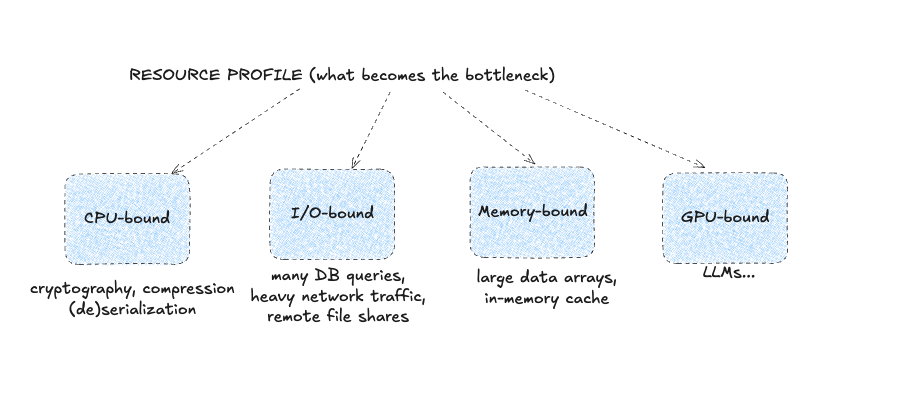
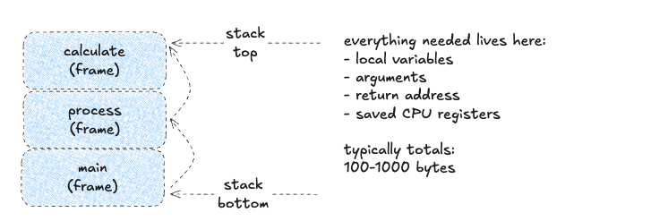

# Function: the atomic unit of code

**The First Nine Guide. Block 1**

***

Functions are the basic unit of every application. Requests call functions; some are fast, some are slow. To reason about performance, I classify functions by a few traits:

1. Algorithmic complexity.
2. Resource profile.
3. Concurrency safety.

Let's go in order.

***

## Algorithmic complexity

A function is a building block of performance. The first and roughest estimate of its behavior is Big-O.

Before you roll your eyes: no heavy math here. To analyze slow code you only need to:

- tell O(1) from O(n^2)
- understand that O(n log n) is the boundary; beyond it there is only pain
- notice when an algorithm suddenly becomes O(n!)

Above the yellow line performance starts degrading as data volume grows.

Here are examples and thresholds for n (I do not have real-life examples of O(n!)):

***

## Resource profiles

Speed is not the whole story; we're doing performance engineering.

Some functions wait on disk, network, or cache. Others burn CPU.

Classify functions early (ideally while writing them):

- IO-bound - waits on network, disk, or DB
- CPU-bound - parses and computes
- Memory-bound - pulls data from RAM without heavy CPU
- GPU-bound - obviously, uses GPU

This tells you where the bottleneck hides: CPU, memory, socket, or the algorithm itself.

***

## Concurrency safety

If code runs in parallel - and it almost always does - ask two questions:

- will we corrupt shared data?
- will we block our neighbors?

Three categories:

- Thread-safe - can be called from any thread
- Thread-unsafe - can break everything
- Conditionally safe - safe only under certain conditions

**Thread-safe:**

1. Works with immutable data.
2. Has no shared mutable state.
3. Synchronizes access to shared data (locks).
4. Uses atomic operations.

**Thread-unsafe:**

1. Mutates global state.
2. Uses static mutable variables.
3. Does non-atomic read-modify-write.
4. Examples: strtok() in C, SimpleDateFormat in Java.

**Conditionally safe:**

1. Safe under external synchronization.
2. Read-only operations on shared data.

***

## Call overhead

Every function call allocates its own memory region called a stack frame.

Each call creates a new frame at the top of the stack; when the function completes, the frame is removed. Even int sum(int a, int b) costs 16-64 bytes of overhead.

**Why should you care?**

Simple:

- Creating a stack frame takes 10-50 CPU cycles (fast, but it hurts in tight loops).

The deeper a function sits in a call chain, the more expensive it becomes (hello, stack overflow). Lambdas and anonymous functions are even pricier.

Dirty hack: inline functions. They remove the frame cost, but try/catch/finally breaks inlining.

***

## Common traps (take them with you)

**Loops:**

- String concatenation in a loop (str += char often becomes O(n^2)).
- Nested loops over large collections (especially unbounded ones).

**Stack overflow risk:**

- Each call creates a stack frame (~100-1000 bytes).
- Deep recursion will exhaust the stack (~1 MB by default).

**Hybrid-bound functions:**

- Blocking I/O inside CPU functions is hard to debug and scale. Avoid it.

> Next up: a breakdown of **[runtime models](2025-12-21-runtime-models.md)**.

Follow the channel [@r9yo11yp9e](https://t.me/r9yo11yp9e) - we will keep chasing the nines.
