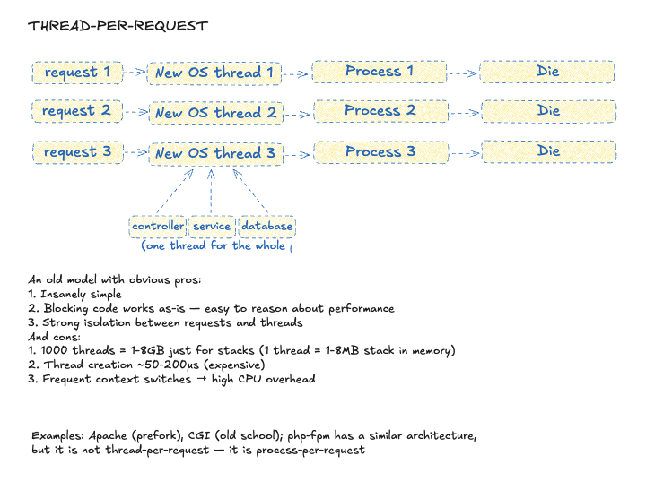
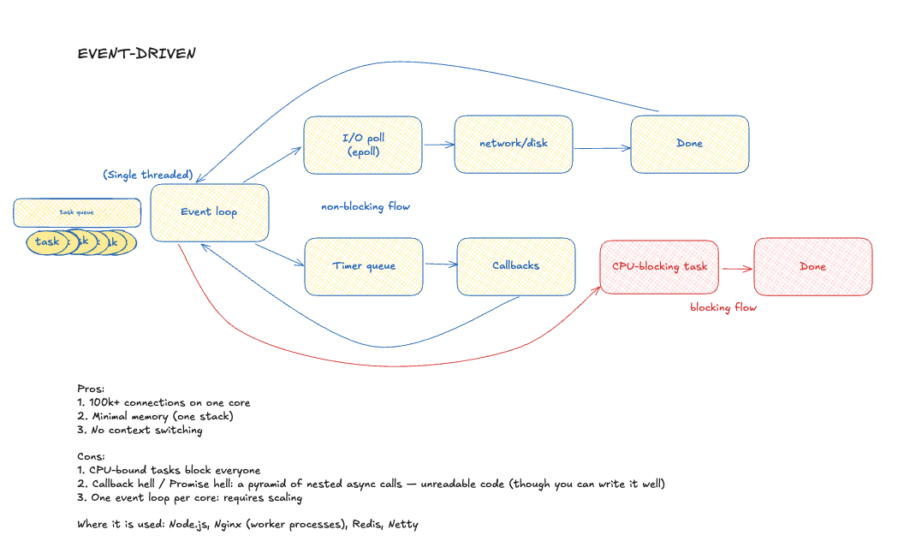
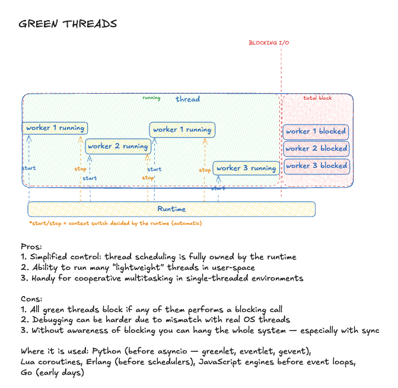
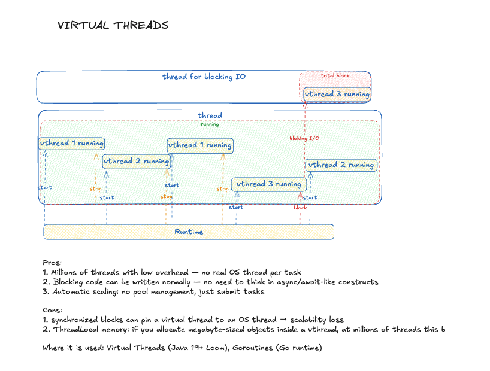

# Runtime models - running thousands of functions at once

**The First Nine Guide. Block 2**

***

**Disclaimer:** real systems blend multiple models. Pure versions are rare.

***

In the previous part we discussed the atom of code - the function. We saw how complexity and characteristics affect performance.

But real systems execute not one, but thousands and tens of thousands of functions at the same time. Who manages that chaos? The answer is the **runtime model**. The choice of model is a foundation of software architecture.

Each model answers two questions:

1. Who owns the threads? (runtime or application code)
2. What happens when a thread blocks?

Let's go through the tradeoffs and where each model fits.

***

## 1. Thread-per-request

One of the oldest models:

> one request - one thread - request completes - thread dies.

**Who owns it:** application code creates heavy threads and forgets them

**Weight:** 1-8 MB per stack; creation ~100 microseconds

**If it blocks:** hardware sits idle

**Use it if:** legacy monolith at 3 RPS - otherwise no.

***

## 2. Thread pool

A logical evolution. We remove creation/destruction overhead, keep a fixed pool of heavy threads and a task queue. This is still common in the wild.

**Who owns it:** the pool assigns tasks to ready threads

**If it blocks:** the thread hangs, the queue grows

**Use it if:** mixed load (CPU + I/O), you want transparency, and you hate "modern" trends.

***

> The next models try to solve the biggest pool problem: heavy threads idle while waiting on I/O.

***

## 3. Event loop

A radical shift. Instead of an army of workers you have one fast **event loop** on a single heavy thread. It kicks off an async operation (DB call, etc.) and immediately moves to other events. When the result is ready, it handles it.

> poll I/O - callbacks - timers - ...

**Who owns it:** the loop itself; only one heavy thread

**If it blocks:** the whole application freezes

**Use it if:** mostly I/O with minimal CPU.

***

## 4. Fibers

Not a separate model but an approach that upgrades the event loop (and beyond), partially solving callback hell. Logic is written inside lightweight fibers. The loop still orchestrates everything, but instead of callbacks it resumes the right fiber. When a fiber hits I/O it yields, keeping the code linear. Fibers can call each other following business logic rather than runtime logic.

**Who owns it:** more control for the developer, but the runtime still drives

**If it blocks:** it blocks the loop as well

**Use it if:** you want clean async in an I/O service.

***

## 5. Green threads

An older model and the ancestor of many new ones. Many lightweight threads live inside one heavy thread. The runtime switches them on a timer.

**Who owns it:** the runtime; everyone lives on one heavy thread

**If it blocks:** any blocking sys-call in a lightweight thread blocks the heavy thread. Everything stops.

**Use it if:** a prototype, small script, lab project.

***

## 6. Virtual threads

A game changer. The evolution of green threads. Millions of lightweight threads managed by the runtime scheduler and executed on a small pool of heavy threads. The key win is blocking behavior.

**Who owns it:** the runtime creates lightweight threads and schedules them onto a heavy pool

**If it blocks:** when a lightweight thread initiates I/O, the scheduler parks it and runs another. Heavy threads do not idle.

*With blocking I/O (e.g., Thread.sleep() or File.read() on a regular socket) pinning may occur and reduce efficiency.*

**Use it if:** modern high-load systems with many network calls. But still use mutexes, timeouts, and fail-fast to avoid millions of parked threads.

***

## 7. Actor model

Not exactly a runtime model but a concurrency model that heavily shapes architecture. There is no shared memory: actors communicate via messages. The scheduler spreads actors across worker threads.

Principles:

- no shared state
- only message passing, no shared memory or locks
- one actor processes one message at a time
- "let it crash" resilience philosophy

**Who owns it:** the actor runtime; an actor handles one message at a time

**If it blocks:** it blocks only itself; others keep working

**Use it if:** you need high resilience and a ready-made framework. Works for microservices and internal service architecture.

***

## Summary table

***

## Hybrid models and where they live

Pure models are rare. Modern runtimes combine approaches to patch weaknesses.

Short list:

1. Worker threads + event loop. Common in Node.js (with Worker Threads). The main event loop handles I/O and a worker pool handles CPU.
2. Multi-loop architecture. Seen in Vert.x. Multiple event loops run in parallel, each on its own heavy thread. A balancer distributes incoming connections.
3. Actor model + thread pools. Typical Akka approach with configurable dispatchers. Different actor types sit on different pools: I/O actors on a large pool, CPU actors on a small one, critical ones on dedicated threads.

***

> Next up: **[typical application architecture](2025-12-22-inner-architecture.md)**.
>
> Previous: **[function attributes](2025-12-20-function-atomic-unit.md)**.

Follow the channel [@r9yo11yp9e](https://t.me/r9yo11yp9e) - we will keep chasing the nines.
