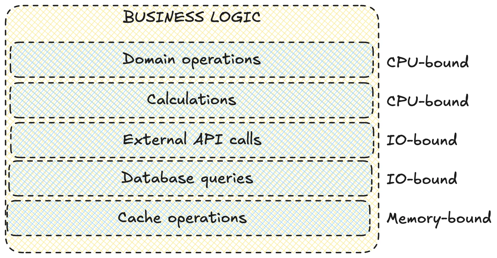
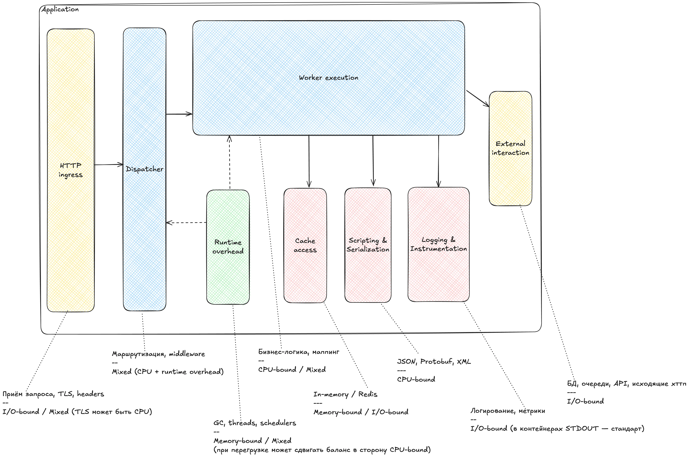

# Typical web-application inner architecture

**The First Nine Guide. Block 3**

***

**Disclaimer:** real-world application architectures vary, but there are common layers that show up almost everywhere. That's what we'll cover.

***

In the previous part we discussed runtime models. A runtime alone is not a web application. Today we will look at what an application must implement inside a runtime to earn that name.

I tried to find a good reference that explained web applications independent of language and runtime. I could not. So here is my own interpretation to fix two problems:

1. Many engineers do not want to dive into application internals - it feels too complex or unclear where to start.
2. The opposite view is also common: "there is a box, an input, an output, and business logic in the middle." That hides what resource each function actually consumes.

Let's open the box.

***

## HTTP request layers

Start with the layers a request passes through. We'll separate four internal layers.

### NETWORK LAYER

**Goal:** turn an HTTP request into structured data for business logic.

**What happens here:**

- socket listen (ports 8080, 443)
- accept connections
- TLS handshake - decrypt HTTPS traffic
- HTTP parsing - headers and body

Many assume this is IO-only. With large HTTPS bodies it can become CPU-bound.

### REQUEST PROCESSING

**Goal:** turn an HTTP request into a function call and route it to the correct handler.

**What happens here:**

- deserialize (JSON/XML/Proto)
- validation & auth
- rate limiting
- request routing by URL

Rate limits are usually memory-bound if local. Distributed limits live in Redis and become IO.

### BUSINESS LOGIC

**Goal:** execute the core logic of the service.

**What happens here:**

- domain operations - algorithms and business rules
- calculations - compute, transform
- external API calls
- database queries - PostgreSQL/MySQL/MongoDB
- cache operations - Redis/Memcached

This is the SRE favorite for incidents. Slow SQL, locks, external APIs without timeouts, and heavy O(n!) compute all live here.

### RESPONSE FORMATION

**Goal:** package the result into an HTTP response and send it back.

**What happens here:**

- serialization (JSON/XML/Proto)
- compression (gzip/brotli)
- encryption for HTTPS
- send to socket

The same problems as the first layer.

### Full picture

***

## Internal architecture

Now that we have layers, let's draw an abstract architecture as if this were a microservice system.

Meet the components. The real system may have more or fewer. The idea is what matters: isolate anything that has its own worker pool or executes outside the application.

List:

- **HTTP Ingress** - entry point, initial routing, load balancing across instances.
- **Dispatcher** - distributes requests to workers, manages queues and priorities.
- **Worker Execution** - core business logic, controllers and services.
- **Runtime Overhead** - GC, schedulers, thread scheduling. The name is intentionally harsh to highlight cost.
- **Cache Access** - in-memory caches and external caches (Redis/Memcached).
- **Scripting & Serialization** - JSON/XML/Protobuf, template engines, data transforms.
- **Logging & Instrumentation** - structured logging and tracing.
- **External Interaction** - databases, queues, HTTP APIs, microservices.

Why does this matter? A simple timeout example:

- Business logic issues an SQL query. The DB has its own pool (e.g., Hikari).
- The pool is exhausted. A worker thread waits for a connection.
- Goroutines accumulate or the worker pool stalls.

Sure, a timeout in the DB pool helps, but in reactive runtimes this is often missed.

### Bag of advice

Knowing the internal architecture makes resilience patterns easier:

- timeouts and TTLs on internal queues
- bulkheads and pool separation (CPU vs IO pools)
- fallback mechanics, even internal circuit breakers

More on patterns later.

***

That's all for now.

> Next: we finish designing the ideal application and deploy it.
>
> Previous: **[runtime models](2025-12-21-runtime-models.md)**.

Follow the channel [@r9yo11yp9e](https://t.me/r9yo11yp9e) - we will keep chasing the nines.
