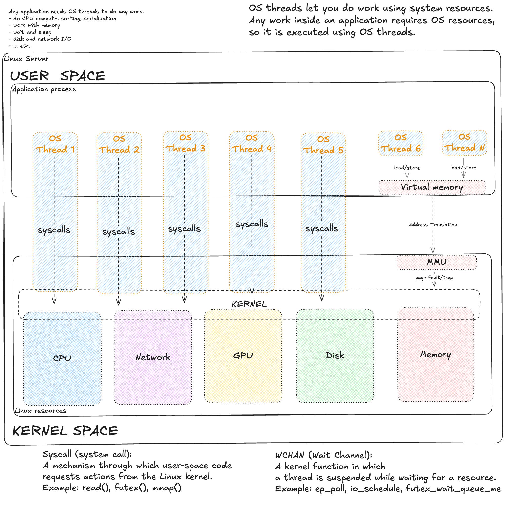

# Application footprint in operating system

**The First Nine Guide. Block 5**

***

You come to an incident. They say the product became slow. You need to understand if the problem is in the system layer or in the software itself, who is responsible and who to call. For years I looked for the most universal way, and I think I found it. This way has many "buts", so it is universal only in theory for now.

This is the last article where we look at the app through OS footprints. Next we dive into the OS itself.

In previous articles we talked about threads. I called them "light" and "heavy" threads. "Heavy" are created by the operating system, and "light" live only inside the app and do not pay all OS thread costs. But the key point is: to consume any resource, CPU or disk, our app (its process) needs OS threads, so "heavy" ones.

This is the bridge between the app/runtime world and the OS world.

Most people know that any code works in some thread/worker (often the same word). In the last article about ideal deployment I marked how runtime thread models map to OS threads. This mapping became my research area. When we ask "app vs OS", it is really a choice between user space and kernel space.

Any code slowdown is first of all a slowdown of "work". Work is very different. But almost always, when our app needs something from the OS, it makes a syscall (system call). There are many of them: reading disk is `read()`, opening a file is `open()`. A syscall is done only by an OS thread. As an analogy, the OS is like a web server with a thread pool, and syscalls are API calls. But to be honest, the OS has another "interface" too: virtual memory. It is harder. We write to memory directly, without syscalls. But if we touch a virtual address that has no physical RAM page yet (or it was swapped out), a CPU block called [MMU](https://docs.kernel.org/admin-guide/mm/concepts.html) triggers a hardware interrupt ([Page Fault](https://docs.oracle.com/cd/E19504-01/802-5880/tif-21/index.html)). Control goes to the kernel, it brings the page, and returns control to the program. For code it is transparent, but for latency it is a real stop of the thread.

So, to understand what can slow our "work", we need to understand what this work can be. The OS is well covered by metrics, so by them we can guess what work was done quite well.

## Anatomy of work: On-CPU and Off-CPU

Work can run on CPU, or without CPU (waiting is also work, because a thread waits too, so it is busy). Work can wait inside the app or inside the system. For system waits there is **Wait Channel (WCHAN)**, which sleeps a thread with a specific reason.

WCHAN appears only if the kernel puts the thread to sleep. Work can be slow because a resource is missing, and then we often see **PSI** metrics (described [here](https://docs.kernel.org/accounting/psi.html)). PSI shows the share of time tasks were forced to wait for a resource. WCHAN is weakly covered by profilers. It is useful to know, but in practice it is rarely in metrics. Another plane of thread state is their [state](https://www.baeldung.com/linux/process-states): R, D, S, etc. We will use it.

Back to work. In performance analysis (per [Brendan Gregg](https://www.brendangregg.com/offcpuanalysis.html)) work is split into two big groups: **On-CPU** (on CPU) and **Off-CPU** (off CPU).

### 1. On-CPU (Thread runs)

This is when a thread uses CPU right now. Thread state is R (Running).

There are three scenarios:

#### 1.1. System Mode (Work in kernel)

The thread runs kernel code by its request (via syscall).

* **Examples:** `getpid()`, `fstat()`, `open()`, `read()`.
* **Meaning:** It goes to kernel space. Some syscalls like `getpid()` are instant, but many (`open()`, `read()`, `connect()`) can block on a resource and move the thread to wait.
* **Metrics:** `system time` grows. When blocked, WCHAN and PSI IO appear.

#### 1.2. Pure User-space (Useful work)

Classic app code execution. It runs without kernel, doing CPU work.

* **Examples:** math, parsing, GC work.
* **Meaning:** Fully in user space.
* **Metrics:** `user time` grows. No kernel, no syscall, no WCHAN, no PSI.

#### 1.3. User-space Busy Wait (Fake work)

The code is logically waiting or in an endless loop, but it burns CPU.

* **Examples:** spin lock or `while(!flag) {}`.
* **Meaning:** The thread spins. For OS it **works** (On-CPU). For code logic it is stuck.
* **Metrics:** Looks like `user time` and often misleads.

We separate: what a thread does (R/S/D state), what type of CPU consumption, and is there any resource wait (PSI). These are three different layers. We must not mix them. We glue them into a set of signals to understand the delay nature.

On-CPU time has 8 common modes. Here is a table with mapping to thread state and PSI:

| **CPU type**  | **Thread State**    | **probable PSI**        | **Meaning**                             |
| ------------- | ------------------- | ----------------------- | --------------------------------------- |
| user          | R (Runnable)        | `psi.cpu.some`*         | App code (useful or Busy Wait)          |
| system        | R (Runnable)        | -                       | Kernel work (syscalls)                  |
| iowait        | D (Uninterruptible) | `psi.io.some` / `full`  | CPU idle, thread waits I/O              |
| irq / softirq | -                   | -                       | Interrupts (network, timer)             |
| idle          | S (Interruptible)   | -                       | CPU idle, thread sleeps                 |
| steal         | R / -               | `psi.cpu.some` / `full` | Hypervisor took CPU from VM             |
| nice          | S / R               | `psi.cpu.full`          | Low priority processes                  |

> *A running thread does not create PSI for itself, but it creates a queue for others.*

A small Linux dictionary (more in links above):

* **R (running)** - the thread is on CPU or waits for CPU in a queue.
* **S (sleep)** - the thread sleeps (network, timer), can be woken up.
* **D (uninterruptible sleep)** - the thread sleeps in kernel, waits for hardware (mostly disk).
* **%iowait** - CPU is idle, waiting I/O, while threads are in D.
* **PSI.XYZ.some** - at least one thread suffered, waiting a resource (CPU/IO/Mem). Direct signal of contention.
* **PSI.XYZ.full** - all threads were waiting a resource (CPU/IO/Mem).

***

Below I want to show how this work is covered by metrics and at what level. Here are classic `node_exporter` metrics, i.e. host monitoring:

| CPU type |                                          |                                                                                 |                      |
| -------- | ---------------------------------------- | ------------------------------------------------------------------------------- | -------------------- |
| user     | `node_cpu_seconds_total{mode="user"}`    | `node_pressure_cpu_waiting_seconds_total`                                       | `node_procs_running` |
| system   | `node_cpu_seconds_total{mode="system"}`  | -                                                                               | `node_procs_running` |
| iowait   | `node_cpu_seconds_total{mode="iowait"}`  | `node_pressure_io_waiting_seconds_total` | `node_procs_blocked` |
| irq      | `node_cpu_seconds_total{mode="irq"}`     | -                                                                               | `node_intr_total`    |
| softirq  | `node_cpu_seconds_total{mode="softirq"}` | -                                                                               | -                    |
| idle     | `node_cpu_seconds_total{mode="idle"}`    | -                                                                               | -                    |
| steal    | `node_cpu_seconds_total{mode="steal"}`   | `node_pressure_cpu_waiting_seconds_total`                                       | -                    |
| nice     | `node_cpu_seconds_total{mode="nice"}`    | `node_pressure_cpu_waiting_seconds_total`                                       | -                    |

`cpu_seconds` shows **consumption** (who owns the resource now), and PSI shows **shortage** (who waits in the queue).

* **User/Nice:** They do not create PSI for the same thread, but their active work creates `cpu_waiting` for *other* processes.
* **IO:** `waiting` (Some) - disk slows a process, but others can run. `stalled` (Full) - disk fully blocks the system (critical!).

Here are container metrics from `cAdvisor`:

| CPU type   | container metrics                            | container_tasks_state | PSI metrics                                                                               |
| ---------- | -------------------------------------------- | ----------------------- | ----------------------------------------------------------------------------------------- |
| user       | `container_cpu_user_seconds_total`           | `running`               | `container_pressure_cpu_waiting_seconds_total`                                            |
| system     | `container_cpu_system_seconds_total`         | `running`               | `container_pressure_cpu_waiting_seconds_total`                                            |
| iowait     | -                                            | `iowait`                | `container_pressure_io_waiting_seconds_total` |
| throttled  | `container_cpu_cfs_throttled_seconds_total`  | `running`*              | `container_pressure_cpu_stalled_seconds_total`                                            |
| steal      | -                                            | -                       | `container_pressure_cpu_waiting_seconds_total`                                            |
| irq / soft | -                                            | -                       | -                                                                                         |
| idle       | -                                            | `sleeping`              | -                                                                                         |

> Throttled processes are formally `running` (ready to run), but the kernel does not give them CPU because the quota is spent (CFS bandwidth control). This is unique because they wait for cgroup permission while in R state. It is correct to count them as Off-CPU.

Metrics are few (for me, always). PSI metrics are great. CPU work types are often underrated, but useful. Very few people look at process states (`running`/`blocked`); they are not super useful, but can help to separate problems when there are many processes.

***

### 2. Off-CPU

Here the thread is not running, CPU is idle.

I made a classification for Off-CPU waits based on their properties and how they look in the system.

#### 2.1. Syscall-based (Explicit wait)

We ask the kernel to wait (network, timer, lock).

* **Examples:** `futex()`, `epoll_wait()`.
* **Meaning:** The kernel puts the thread to sleep (S or D), into a wait queue.
* **Metrics:** PSI appears if we wait for an overloaded resource. WCHAN is always there (kernel sleeps the thread at a specific point), but in common metrics (node_exporter/cAdvisor) it is missing — you can see the reason only on the node itself.

#### 2.2. Page Faults (Implicit wait)

We just touched memory.

* **Examples:** page faults are inevitable when we work with memory; it happens when we access addresses with no RAM pages.
* **Meaning:** MMU triggers an interrupt, kernel stops us and goes to disk/swap.
* **Metrics:** WCHAN (`do_page_fault`) and maybe PSI Memory.

The table below shows how many waits, even system ones, we do not see in metrics, not to mention waits inside the app.

| **Wait type** | **How to detect (WCHAN)**                    | **Node Exporter (PSI)**     | **CAdvisor (PSI)**          |
| ------------ | --------------------------------------------- | --------------------------- | --------------------------- |
| Timer / sleep | `nanosleep`, `hrtimer_sleep`, `pause`         | -                           | -                           |
| Locks (app)   | `futex_wait_queue_me`, `pthread_cond_wait`    | -                           | -                           |
| Events / network | `ep_poll`, `poll_schedule_timeout`        | -                           | -                           |
| I/O wait      | `io_schedule`                                 | `io_waiting` / `io_stalled` | `io_waiting` / `io_stalled` |
| Page Fault    | `do_page_fault`, `swap_readpage`              | `memory_stalled`            | `memory_stalled`            |

So, there is no universal metric or simple way to quickly show what causes delays in the app. Below I try to squeeze maximum from the metrics we usually have.

First, the approach. I call it **System Footprint**. It is based on the assumption that in 90% cases we have either `node_exporter` metrics, or container `cAdvisor` metrics (or both). Metrics give us transparency of OS work. The app itself is usually covered in a very specific and non-universal way, so it often stays a black box (or gray).

A metaphor: we know the state of the Black Box because it is inside a Glass Box and we see how the app interacts with the system. We can draw many conclusions (even useful) about the app.

### Operation cost scale (transition to the method)

Let us take a more practical scale:

* **Cheap** - nanoseconds: registers/L1/L2 cache.
* **Moderate** - microseconds: syscalls, context switch, RAM access, NVMe I/O (~30-40 µs). With millions per second it becomes visible.
* **Expensive** - milliseconds: network inside DC, short disk queues, HDD sequential.
* **Very expensive** - tens of milliseconds and more: HDD random, swap/major faults, RTO/many retransmits, long disk queues.

Ranges depend on hardware and workload. It is a guide, not hard thresholds.

## System Footprint Method

**System Footprint Method** is a performance analysis method based on [USE method](https://www.brendangregg.com/usemethod.html) by Brendan Gregg and extended with a view through "footprints" of load in key system metrics. It is a forensic idea: find where CPU and app time goes by looking at signs (footprints) of load or waiting at each system level. We check process states, CPU time split, PSI, and main subsystems (CPU, disk, network, memory) to find the bottleneck. If a subsystem has abnormal metrics, there are "footprints", so we dig there. If graphs show **no** signs (no footprints), we assume the system is idle or waits for external resources (locks, network calls), i.e. the reason is outside CPU/disk/memory.

For this method I prepared a [Grafana dashboard](../dashboards/system-footprint.json) that shows all metrics below. But the method is universal and works with any monitoring tool.

Below is the analysis sequence and how to read metrics.

### 0. Process States: Running vs Blocked

First, inspired by the picture above (app on top, threads go down to kernel), it is useful to check threads: metrics exist for two states - Running (R) and Blocked (D). Understand the scale: these are workers that do your app work. Metrics can show two states:

* **Running (R)** - if the number of OS threads in state *R* is much higher than CPU cores, a CPU queue forms (threads wait for a core). This is a CPU overload sign: more compute tasks than capacity. Even if the runtime hides waits inside (e.g., JVM web pool), R-state shows heavy threads do not get their time slice. In node metrics it is usually `node_procs_running` (count of OS threads, including kernel threads).
* **Blocked (D)** - if there are OS threads in *D* state (especially spikes), threads are stuck waiting for I/O. Each blocked D-thread means the system waits for disk, and useful work is idle. D spikes come with higher request latency and performance drop. In general many D means waiting for hardware, mostly disk. D threads do not use CPU and are not visible in CPU load. In node metrics this is usually `node_procs_blocked` (also includes kernel threads).

Important: metrics usually give only R and D (node_exporter, cAdvisor). S/Z and their variants are not visible or only partially in aggregated counters. The picture is incomplete, and that is ok.

I recommend to compare these thread counts with what your app should do and how many threads it should create (of course if your node does not run 100 apps). If threads are much more than you expected, your runtime probably hides something or you have a config issue.

Then step by step: first PSI (is there pressure?), then blocks by resource - CPU, Disk, Network, Memory.

### 1. PSI Overview

The simplest and most useful thing to look at (if this metric exists) is PSI. It is available on [host](https://github.com/prometheus/node_exporter/pull/1325), in containers [inside k8s](https://kubernetes.io/docs/reference/instrumentation/understand-psi-metrics), and [outside k8s](https://github.com/google/cadvisor/pull/3649).

**Pressure Stall Information** shows the share of time when tasks were forced to wait because of lack of CPU, IO, or memory. It is not load, but the percent of "lost" time. `some` means at least one thread was delayed; `full` means all runnable tasks were delayed (on host cpu.full is almost always 0, in cgroup it appears when CFS quotas are hit). We care about size and duration, not only "> 0". Load Average is useful as a trend, but it mixes runnable and D-state and is not normalized by cores; PSI is more precise for wait time.

How to read:

* **PSI CPU.some** - signal of CPU contention. Then check: is `user/system` high, is there single-thread or busy-wait (PSI low, `user` high).
* **PSI IO.some** - disk delays. Check util/latency/queue and D-state count. Reaction depends on disk type and I/O pattern.
* **PSI Memory.some** - share of time tasks could not get memory and waited while kernel freed RAM, evicted pages (from cache or to swap) and/or read them back from disk.
* **All PSI near zero, but service is slow** - delay can be in network or inside the app (external API, locks). Then use app metrics or profilers.

Wherever you collect metrics, the logic is one: if PSI exists - choose a subsystem to investigate; if PSI is zero - look outside the kernel.

## How to check System Footprint top-down

The view is simple: first pressure (PSI), then by resources - CPU, disk, network, memory. In each group we answer one question and decide to go deeper or move on.

### 2. CPU: pressure, spend, balance

This is about On-CPU part (user/system/softirq/steal), together with PSI CPU and R-state from the start.

* **Where does CPU go?** - look at user/system/softirq/steal split. High `system` means time in kernel (syscalls, drivers). High `softirq` means kernel is busy with network/disk in software interrupts. `steal` means hypervisor takes time from VM. Reaction: spread IRQ, limit heavy threads, profile code/GC.
* **Is there CPU contention?** - read PSI CPU with context switches. Node Exporter gives total context switches (`node_context_switches_total`), without voluntary/involuntary split; cAdvisor usually has none. A high counter alone (or growth) without normalization by cores is not a signal, but with performance drop it can hint too many threads or lock contention. High PSI with low switches can mean cgroup quotas or single-thread.
* **Is there imbalance per core?** - per-core load shows hot cores. One CPU is busy, others idle: hot thread or IRQ pinned to one core. On VMs and without RSS/irqbalance this is common: all network/disk traffic can stick to one CPU. Fix with IRQ/RPS and correct worker count (separate topic).

About load average: it is an average of runnable + D-state over 1/5/15 min, not normalized by cores, and includes blocking (D) tasks. On multi-core systems LA can be high with even load, or low with one hot core. Research (e.g., man proc(5), LWN articles) says LA is a symptom, not truth. Use it as a trend and always confirm with PSI, R-state, and per-CPU load.

If there is no CPU pressure or it is explained, move to other resources.

### 3. Disk: latency and queues

These are Off-CPU waits from our model: growth of PSI IO and D-state shows threads wait for disk.

* **Is I/O latency growing?** - most universal signal: average time per operation (await): it is queue + device service time. In node_exporter: `rate(node_disk_read_time_seconds_total) / rate(node_disk_reads_completed_total)` (and same for write).
* **If latency grows - why?** - two helper signals:
  * **Queue depth** - `rate(node_disk_io_time_weighted_seconds_total)`. If queue grows, requests pile up faster than disk serves them (Little's law: Queue ≈ IOPS × Latency).
  * **Utilization** - `rate(node_disk_io_time_seconds_total)`. High util means "disk always busy", but alone it does not prove a bottleneck (especially on SSD/NVMe). Confirm with latency/queue.
* **Where is iowait?** - iowait in CPU row means CPU is idle while waiting disk. It can match util/latency/PSI IO. User/system and iowait are mutually exclusive on a core, but app impact adds up - we wait disk and do no useful work.
* **iowait trap** ([details](https://lwn.net/Articles/551284/)) - iowait is CPU state (idle), not thread state. A thread calls `read()` → goes to D-state off-CPU → CPU becomes free. When CPU is idle and there is pending I/O, it is counted as iowait. If new work arrives, CPU switches to it, iowait drops, but the thread still waits disk in D. Nuance: iowait shows "CPU idle with I/O", not "how long we wait disk". Waiting is tracked in `procs_blocked` and PSI IO. So with 100% disk util and busy CPU, iowait can be 0%, but threads still wait in D. Trap: you see low iowait and think disk is not a problem, but threads are waiting and work stops. Look at disk util, D-state and PSI IO together, not only iowait.
* **Swap stall** - any swap I/O (page-in/page-out) almost always means memory pressure: system does disk I/O to free RAM, and this hurts disk latency even if the disk as a device is ok.
* **Errors/retries** - if you have error/retry metrics on disk/RAID/NVMe (or at least dmesg/SMART), check them. Retries and device degradation almost always show higher latency. Node_exporter has no clear disk error counters; then rely on SMART/dmesg/vendor metrics.

Reaction depends: faster disk (NVMe, more IOPS), change I/O pattern (batching, less fsync), remove swap by adding memory. If PSI IO is flat and util is low, disk is likely not the main cause.

### 4. Network: losses and queues (my favorite block)

Network waits are Off-CPU: when a thread waits on socket/epoll, it is in S-state (WCHAN: `ep_poll` / `tcp_recvmsg`) and does not show in PSI.

* **Do we receive traffic fast enough?** - drops and queues on our node answer this:
  * **Drops / backlog** - first locate the **layer** where packets are lost:
    * **Interface level (NIC/driver/RX/TX queues)** - `node_network_receive_drop_total` / `node_network_transmit_drop_total` (per interface). Check physical `eth*` and virtual (`veth*`/`cni*`/`tap*`): sometimes the physical NIC is clean, but the container interface has drops.
    * **Softnet backlog level (CPU cannot digest input)** - `node_softnet_dropped_total` with `node_softnet_processed_total`.
    * **TCP/socket receive path (packet reached TCP stack, but queues/buffers overflow)** - localize where it overflows **inside TCP receive path** using TcpExt counters: `node_netstat_TcpExt_ListenOverflows`/`node_netstat_TcpExt_ListenDrops` (listen/accept overflow), `node_netstat_TcpExt_TCPRcvQDrop` (drop in rcv queue due to rcvbuf limits), `node_netstat_TcpExt_TCPOFOQueue` (out-of-order queue growth).
    * **Receive errors** - `node_netstat_Tcp_InErrs`: how many incoming TCP segments were accepted with error. Any growth is a signal of problems on receive path (bad segments, checksum/offload/driver/port).
    Drops on receive cause losses; then sender retransmits and client latency grows. This lets us connect cause and effect with only network metrics.
* **Is the remote side (or the network between) too slow to receive?** - retransmissions answer this:
  * **Retransmissions** - re-sending lost packets. Metrics: on **node** `node_netstat_Tcp_RetransSegs` (node_exporter), in **container** similar TCP metrics exist in cAdvisor with advanced TCP stats, in **k8s** (limited cAdvisor) there are no TCP metrics. Also check SYN retries: `node_netstat_TcpExt_TCPSynRetrans` (SYN retrans on handshake; affects connect latency and errors, especially for short connections).
    Retransmits are **fast** (fast retransmit: 3 dupACK → resend without timeout) and **timeout** (RTO/backoff: 200 → 400 → 800 → 1600 → 3200 ms … up to tens of seconds).
    In node_exporter we have a size issue: `node_netstat_Tcp_RetransSegs` counts segments, and `node_netstat_TcpExt_TCPTimeouts` counts timeout events (RTO). So we cannot precisely split fast vs RTO without extra TcpExt fields, but we can make an optimistic lower bound for heavy losses.
    Retransmits are normal: they can happen even in good times (also because of out-of-order packets, see [RFC 4653](https://datatracker.ietf.org/doc/html/rfc4653)). For diagnosis, look at **share of traffic** and **trend**.
    Causes are two groups: (1) loss/errors in network (link/port/overload), (2) remote side is too slow to receive/process (queues, slow server/DB and drops).
    For scale: a Linux test with CUBIC (default [congestion control](https://www.rfc-editor.org/rfc/rfc5681)) on 10G bulk traffic with controlled loss: loss 1% → throughput ~2.36 Gbit/s, loss 5% → ~0.512 Gbit/s, loss 10% → ~0.028 Gbit/s, loss 15% → ~0.002 Gbit/s. For rough loss impact there is [Mathis formula](https://en.wikipedia.org/wiki/TCP_congestion_control#Rate_equation) and it is even worse. Real numbers depend on congestion control and network conditions - use it as a guide. Test method: [TCP Congestion Control in Action](https://alebsys.github.io/posts/cwnd-retransmit/).
    To interpret retransmits, check percent in total traffic:
    - retrans share in TCP traffic: `rate(node_netstat_Tcp_RetransSegs) / rate(node_netstat_Tcp_OutSegs)`
    - RTO lower bound: `rate(node_netstat_TcpExt_TCPTimeouts) / rate(node_netstat_Tcp_OutSegs)`. 1 RTO timeout means at least 1 retransmitted segment.
    - fast retrans lower bound: `(rate(node_netstat_Tcp_RetransSegs) - rate(node_netstat_TcpExt_TCPTimeouts)) / rate(node_netstat_Tcp_OutSegs)`
    Then you can estimate useful traffic share: `(rate(node_netstat_Tcp_OutSegs) - rate(node_netstat_Tcp_RetransSegs)) / rate(node_netstat_Tcp_OutSegs)` - retransmits push out useful data.
    The bigger the share of RTO retransmits, the worse. Even 1% is already a lot. If there are no RTO, then fast retrans needs ~10-20% to really hurt. Thresholds from tests and prod can vary.
* **Do we hit system network limits?** - another class of issues, partly same as disk, but grouped here:
  * **Conntrack / TIME_WAIT** - **Conntrack** (`nf_conntrack`) is a kernel table that tracks active TCP/UDP connections for NAT, firewall (iptables/nftables) and stateful filtering. Each new connection adds a record. Near the limit (`node_nf_conntrack_entries` → `node_nf_conntrack_entries_limit`) new connects are dropped - it looks like "pings work, but new DB connections hang". **TIME_WAIT** is a TCP state after close (lives ~60 seconds by default). It stays on the side that closed first (often server in HTTP/1.1; in HTTP/2/gRPC this is softer due to persistent channels). Many TIME_WAIT on clients can hit ephemeral port limits and block outgoing connections; in practice it depends on `net.ipv4.ip_local_port_range` + number of TIME_WAIT sockets.
  * **Backlog / somaxconn / SYN backlog** - limits of incoming queues. When they hit, it looks like "new connects are slow/fail", while traffic/pings are fine. In metrics it shows as `node_netstat_TcpExt_ListenOverflows`/`node_netstat_TcpExt_ListenDrops` (listen/accept queues), and for SYN phase - growth of `node_netstat_TcpExt_TCPSynRetrans` on clients. Limits live at several levels: app backlog (`listen()`), `net.core.somaxconn`, `net.ipv4.tcp_max_syn_backlog`.
  * **File descriptors (FD)** - each TCP connection/socket uses an FD. When you hit FD, new accept/connect fails (often in logs as "too many open files"). At node level check `node_filefd_allocated` and `node_filefd_maximum`; also process limits (ulimit/systemd LimitNOFILE) and system limits (`fs.file-max`/`fs.nr_open`).
  * **Inodes** - inodes limit number of files/dirs. When inodes are exhausted, creating files/dirs (and Unix sockets with FS paths) fails even if disk space is free. At node level check `node_filesystem_files_free` / `node_filesystem_files`.

With retrans/drops first check network/stack (losses, queue overflow), then app. With normal drops/retrans and PSI near zero, look at external dependencies (API/DB) that are slow. Drops/retrans are signals of loss/overflow (often earlier than "throughput limit"). For "slow without clear loss" add TCP timeouts/queues: `node_netstat_TcpExt_TCPTimeouts` (RTO) and queue overflow counters (rcv/OFO/listen). **RTT does not live in these counters** - it is per-socket state; use `ss -ti` (tcp_info: `rtt`, `rto`, `retrans`) or app/proxy metrics.

### 5. Memory: pressure and faults

Start with sharp problems.

* **Is there OOM?** - on node check `node_vmstat_oom_kill`. At container level OOM events are in cAdvisor `container_oom_events_total`. If OOM exists, it is no longer "footprint diagnosis", but a limits/requests and app behavior review.
* **Do we hit container memory limit?** - in cgroup v1 cAdvisor exports `container_memory_failcnt` (from `memory.failcnt`): number of failed allocations due to limit. Growing failcnt without OOM means working at the limit with constant reclaim. For limit context check `container_memory_usage_bytes` and `container_spec_memory_limit_bytes`. Here also check container awareness (does runtime see cgroup limits) and correct limit detection (see **[Ideal application deployment](ideal-deployment.md)**, block 4).
* **Is there free memory right now?** - check `node_memory_MemAvailable_bytes / node_memory_MemTotal_bytes` and its dynamics: sharp drops often match latency degradation. Also check if you hit a threshold visually - it can be due to limits (cgroup limits/requests).
* **Is swap present and used?** - two different questions:
  * **swap enabled**: `node_memory_SwapTotal_bytes > 0` - swap exists (not yet a problem, it may be empty, but it is a flag to check more).
  * **swap used**: `node_memory_SwapTotal_bytes - node_memory_SwapFree_bytes` (plus `node_memory_SwapCached_bytes`) - how much data is already swapped out. "Swap used" does not mean disk is busy now, but it is a risk: access will need disk page-in and is much slower than RAM.
  * **swap actively used**: `node_vmstat_pswpin` / `node_vmstat_pswpout` (use rate) - pages move between RAM and swap right now. This is where disk affects latency: swap-in blocks threads on memory access path.
* **Do we read pages from disk due to major faults?** - `node_vmstat_pgmajfault`: growth means page faults became "major", kernel had to read a page from disk before continuing. The disk can be (1) swap (swap-in), (2) file-backed pages (page cache miss / mmap). `node_vmstat_pswpin`/`node_vmstat_pswpout` count pages that went through swap: if `pgmajfault` grows with `pswpin`, then major faults are swap; if `pgmajfault` grows but `pswpin/pswpout` do not, it is more often file-backed pages.
* **Minor faults: do they matter?** - minor faults are normal (first touch, COW, etc.). They matter when they grow by orders and become notable CPU/latency cost. At node level a rough estimate is `node_vmstat_pgfault - node_vmstat_pgmajfault`, but interpret only in workload context and dynamics.

Next actions depend on load: add memory, adjust limits/requests, reduce caches/heap, set GOMEMLIMIT/ActiveProcessorCount, etc. In containers it is important to separate working set from page cache (e.g., `container_memory_working_set_bytes` vs usage).

### 6. If there are no footprints

PSI ≈ 0, disk/network/memory are calm, but the service is slow? Then the delay is above OS level:

* **external dependency (DB, API)** - look in tracing and app metrics;
* **lock contention in app** - see `futex_wait` in off-CPU profilers;
* **wrong parallelism** - single-thread hot path, short pool, no backpressure.

Then move to code profiling (on-CPU and off-CPU profilers, tracing).

---

## What to do next

System Footprint Method gives direction, not a solution. Next actions depend on where the problem is:

**If the problem is in the app** (high user time without PSI, lock contention, external API):
* **Profile the app**: on-CPU (perf, pprof), off-CPU (offcputime), tracing (OpenTelemetry, Jaeger).
* **Optimize** code, algorithms, parallelism.

**If metrics are not enough** (container shows a problem, but details are hidden):
* **Go to host level**: check node_exporter metrics for the node where the container runs.
* **Check** if the bottleneck is shared (CPU, disk, network) with neighbors.
* **Use system tools**: `perf`, `bpftrace`, `iotop`, `tcpdump`.

**If the problem is in host resources** (PSI high, util 100%, latency grows):
* **Tune the system**: scheduler (CFS/nice), I/O scheduler (mq-deadline/kyber), network parameters (RSS/RPS, ring buffers), memory (vm.swappiness, THP).
* **Add resources**: add CPU/RAM, move to faster disks (NVMe), improve network (10G → 25G, lower RTT).
* **Move load**: horizontal scaling, move services to other nodes.

System Footprint Method is a checklist for fast diagnosis, not a replacement for profilers. It shows where to start digging.

***

> In the previous series — **[we talked about deploying the app without throttling](ideal-deployment.md)**.
>
> Next I will talk about parallelism and concurrency at CPU level.
