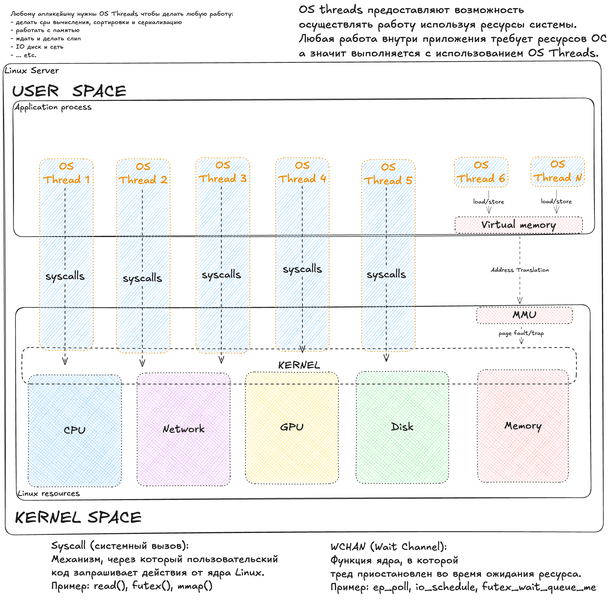

# Application footprint in operating system

**The First Nine Guide. Блок 5**

***

Вот вы пришли на инцидент, где вам сказали, что продукт что-то начал делать медленно, и вам предстоит понять проблема в системном слое или в самом программном обеспечении, кто виноват и кого звать на помощь. Годами я искал максимально универсальный вариант и, думаю, нашел. У варианта большое количество "но" и поэтому универсальный он, пока, только теоретически.

Это последняя статья, где мы смотрим на приложение через отпечатки ОС. Дальше ныряем в саму операционную систему.

В прошлых статьях мы с вами осознавали такую вещь как потоки. Я обзывал их "легкие" и "тяжелые" потоки. И "тяжелые" это те, которые создаются на уровне операционной системы, а "легкие" существуют только внутри приложения и не несут всех накладных расходов, которые есть у потоков операционной системы. Но самое главное, чтобы потреблять хоть какой-то ресурс, будь то процессор или диск, нашему приложению, а точнее, его процессу нужны именно потоки операционной системы, то есть "тяжелые".

Именно здесь находится мост между миром приложения/рантайма и миром операционной системы.

Думаю очень многим известно, что любой код совершает работу в каком-то потоке/треде/воркере (часто это синонимы). И в последней статье про деплой идеального приложения я везде подписывал, как потоковая модель рантайма маппится на потоки операционной системы. Именно этот маппинг и стал зоной моего исследования. Когда перед нами стоит вопрос между приложением и операционкой, на самом деле это выбор между user space и kernel space.

Итак, любое замедление кода это в первую очередь замедление "работы". Работа бывает очень разная, но почти всегда, когда нашему приложению надо что-то от операционной системы, то совершается syscall (системный вызов). Их бывает много, и например чтение диска это системный вызов "read()", а открытие файла "open()". Syscall выполняется только потоком операционной системы. Для аналогии, можно сказать, что ОС это некий веб-сервер с привычным тред пулом, а syscall это вызовы апи. Но чтобы быть полностью честным, стоит сказать, что у операционной системы помимо syscalls есть и другой "интерфейс" - это виртуальная память процесса. С ней чуть сложнее: мы пишем в память напрямую, без явных syscall. Но если мы обращаемся к адресу виртуальной памяти, которому еще не назначена физическая страница RAM (или она была выгружена в swap), специальный блок процессора под названием [MMU](https://docs.kernel.org/admin-guide/mm/concepts.html) триггерит аппаратное прерывание ([Page Fault](https://docs.oracle.com/cd/E19504-01/802-5880/tif-21/index.html)). Управление мгновенно переходит ядру, оно подкладывает нужный кусок памяти и возвращает управление программе. Для кода это происходит прозрачно, но с точки зрения задержек - это реальная остановка работы потока.

Теперь для того чтобы понять, что может повлиять на то насколько быстро происходит наша "работа", надо понять какая она бывает. Сама операционная система довольно хорошо покрыта метриками, поэтому по ним можно понять какая именно работа выполнялась довольно точно. 

## Анатомия работы: On-CPU и Off-CPU

Работа может выполняться на каком-то CPU, а может и без CPU (ожидание - это тоже работа, потому что ждать тоже должен какой-то тред, а значит он в этот момент занят). Работа может ждать чего-то внутри приложения и внутри системы. Для внутрисистемных ожиданий есть механизм под названием **Wait Channel (WCHAN)**, который приостанавливает тред с какой-то конкретной причиной.

WCHAN появляется только если тред был усыплён ядром. Работа может выполняться медленно из-за нехватки какого-то ресурса, часто в таком случае мы можем видеть **PSI метрику** (описана [тут](https://docs.kernel.org/accounting/psi.html)). PSI фиксирует долю времени, когда задачи вынужденно ждали ресурс. WCHAN довольно слабо покрыт профилировщиками, знать о нём полезно архитектурно, но практически он редко доступен в метриках. Еще одна из плоскостей, описывающая состояние потоков - это их [состояние](https://www.baeldung.com/linux/process-states): R, D, S и др. Этим попробуем воспользоваться.

Вернемся к работе. В перформанс анализе ([по Брендану Греггу](https://www.brendangregg.com/offcpuanalysis.html)) ее принято делить на две большие категории: **On-CPU** (на процессоре) и **Off-CPU** (вне процессора).

### 1. On-CPU (Тред исполняется)

Это состояние, когда тред использует ядро CPU прямо сейчас. Статус потока - R (Running).

Здесь есть три сценария:

#### 1.1. System Mode (Работа в ядре)

Поток выполняет код ядра по своему запросу (через syscall).

* **Примеры:**`getpid()`, `fstat()`, `open()`, `read()`.
* **Суть:** Переходит в kernel-space. Часть syscalls вроде `getpid()` выполняется мгновенно, но многие (`open()`, `read()`, `connect()`) могут блокироваться на ресурсе и переводить тред в ожидание.
* **Метрики:** Растет `system time`. При блокировке появляются WCHAN и PSI IO.

#### 1.2. Pure User-space (Полезная работа)

Классическое исполнение кода вашего приложения. Оно делается без kernel напрямую делая вычисления на процессоре.

* **Примеры: **математика, парсинг, работа GC.
* **Суть:** Полностью в user-space.
* **Метрики:** Растет `user time`. Нет ядра, нет syscall, нет WCHAN, нет PSI.

#### 1.3. User-space Busy Wait (Ложная работа)

Ситуация, когда код логически ждет или бесконечно зациклился, но фактически жжет CPU.

* **Примеры**: спинлок или while(!flag) {}
* **Суть:** Тред крутится в цикле. С точки зрения ОС он **работает** (On-CPU). С точки зрения логики кода - завис.
* **Метрики:** В метриках это выглядит как `user time` и часто вводит в заблуждение.

Мы различаем, что делает поток (R/S/D - статус потока), какой тип потребления CPU и есть ли у нас ожидание какого-то ресурса (PSI). Это три разных слоя наблюдения, их нельзя путать - мы их склеиваем в набор сигналов, чтобы понять природу задержки.

On-CPU время делится на знакомые 8 вариантов работы. Вот сводная табличка по ним с маппингом на состояние тредов и PSI:

| **CPU type**  | **Thread State**    | **вероятный PSI**       | **Интерпретация**                       |
| ------------- | ------------------- | ----------------------- | --------------------------------------- |
| user          | R (Runnable)        | `psi.cpu.some`*         | Код приложения (полезный или Busy Wait) |
| system        | R (Runnable)        | -                       | Работа ядра (syscalls)                  |
| iowait        | D (Uninterruptible) | `psi.io.some` / `full`  | CPU свободен, поток ждет I/O            |
| irq / softirq | -                   | -                       | Прерывания (сеть, таймер)               |
| idle          | S (Interruptible)   | -                       | CPU свободен, поток спит                |
| steal         | R / -               | `psi.cpu.some` / `full` | Гипервизор отобрал CPU у виртуалки      |
| nice          | S / R               | `psi.cpu.full`          | Процессы с низким приоритетом           |

> *Сам работающий поток не генерирует PSI для себя, но создает очередь для других.*

Собрал маленький разговорник с линуксового (остальное по ссылкам выше):

* **R (running)** - поток на CPU или ждёт CPU в очереди.
* **S (sleep)** - поток спит (сеть, таймер), его можно разбудить/прервать.
* **D (uninterruptible sleep)** - поток спит в ядре, ждёт железо (в основном диск).
* **%iowait** - CPU простаивает, ожидая I/O, пока потоки в статусе D.
* **PSI.XYZ.some** - как минимум один тред страдал, ожидая ресурс (CPU/IO/Mem). Прямой индикатор конкуренции за ресурсы.
* **PSI.XYZ.full** - все треды ожидали ресурс (CPU/IO/Mem). 

***

Ниже я хочу показать, насколько вообще эта работа покрыта метриками и на каком они уровне. Вот классические метрики всеми любимого `node_exporter`, другими словами мониторинг ноды/хоста/сервера:

| CPU type |                                          |                                                                                 |                      |
| -------- | ---------------------------------------- | ------------------------------------------------------------------------------- | -------------------- |
| user     | `node_cpu_seconds_total{mode="user"}`    | `node_pressure_cpu_waiting_seconds_total`                                       | `node_procs_running` |
| system   | `node_cpu_seconds_total{mode="system"}`  | -                                                                               | `node_procs_running` |
| iowait   | `node_cpu_seconds_total{mode="iowait"}`  | `node_pressure_io_waiting_seconds_total` | `node_procs_blocked` |
| irq      | `node_cpu_seconds_total{mode="irq"}`     | -                                                                               | `node_intr_total`    |
| softirq  | `node_cpu_seconds_total{mode="softirq"}` | -                                                                               | -                    |
| idle     | `node_cpu_seconds_total{mode="idle"}`    | -                                                                               | -                    |
| steal    | `node_cpu_seconds_total{mode="steal"}`   | `node_pressure_cpu_waiting_seconds_total`                                       | -                    |
| nice     | `node_cpu_seconds_total{mode="nice"}`    | `node_pressure_cpu_waiting_seconds_total`                                       | -                    |

Метрики `cpu_seconds` показывают **потребление** (кто сейчас владеет ресурсом), а метрики PSI показывают **нехватку** (кто стоит в очереди).

* **User/Nice:** Сами по себе не генерируют PSI для текущего потока, но их активная работа создает `cpu_waiting` для *других* процессов, ожидающих в очереди.
* **IO:**`waiting` (Some) - диск тормозит процесс, но другие могут работать. `stalled` (Full) - диск полностью заблокировал работу системы (критично!).

А вот метрики из контейнеров, то что показывает `cAdvisor`:

| CPU type   | container metrics                            | container_tasks_state | PSI metrics                                                                               |
| ---------- | -------------------------------------------- | ----------------------- | ----------------------------------------------------------------------------------------- |
| user       | `container_cpu_user_seconds_total`           | `running`               | `container_pressure_cpu_waiting_seconds_total`                                            |
| system     | `container_cpu_system_seconds_total`         | `running`               | `container_pressure_cpu_waiting_seconds_total`                                            |
| iowait     | -                                            | `iowait`                | `container_pressure_io_waiting_seconds_total` |
| throttled  | `container_cpu_cfs_throttled_seconds_total`  | `running`*              | `container_pressure_cpu_stalled_seconds_total`                                            |
| steal      | -                                            | -                       | `container_pressure_cpu_waiting_seconds_total`                                            |
| irq / soft | -                                            | -                       | -                                                                                         |
| idle       | -                                            | `sleeping`              | -                                                                                         |

> Throttled процессы формально в состоянии `running` (готовы работать), но kernel не даёт им CPU из-за исчерпания квоты (CFS bandwidth control). Это уникальное состояние потому что они ожидают разрешения от cgroup находясь в состоянии R. Правильно их считать как Off-CPU.

Метрик, на мой взгляд, маловато (но мне редко когда хватает). Метрики PSI - восхитительны, типы работы CPU часто недооцениваются, а они полезны. Совсем мало кто смотрит на процессы и их состояния (`running`/`blocked`), пользы в них немного, но это может сильно помочь в сепарации проблем, если процессов несколько.

***

### 2. Off-CPU

Здесь тред временно не исполняется, CPU свободен.

Я собрал категоризацию для Off-CPU ожиданий исходя из их свойств и того, как они выглядят в системе.

#### 2.1. Syscall-based (Явное ожидание)

Мы сами попросили ядро подождать (сеть, таймер, лок).

* **Примеры:**`futex()`, `epoll_wait()`.
* **Суть:** Ядро переводит тред в sleep(S или D), помещает в wait queue.
* **Метрики:** PSI бывает, если ждём перегруженный ресурс. WCHAN при этом есть всегда (ядро усыпило тред в конкретной точке), но в типовых метриках (node_exporter/cAdvisor) его нет — увидеть причину сна можно только зайдя на саму ноду.

#### 2.2. Page Faults (Неявное ожидание)

Мы просто обратились к памяти.

* **Примеры:** По сути page faults неизбежны при работе с памятью, он вызывается всегда когда мы обращаемся к адресам, у которых нет страниц в RAM.
* **Суть:** MMU триггерит прерывание, ядро останавливает нас и лезет на диск/swap.
* **Метрики:** WCHAN (`do_page_fault`) и может быть PSI Memory.

Табличка ниже для демонстрации того какое количество, даже системных ожиданий мы не видим в метриках, не говоря уже про ожидания внутри самого софта.

| **Тип ожидания** | **Как распознать (WCHAN)**                    | **Node Exporter (PSI)**     | **CAdvisor (PSI)**          |
| ---------------- | --------------------------------------------- | --------------------------- | --------------------------- |
| Таймер / сон     | `nanosleep`, `hrtimer_sleep`, `pause`         | -                           | -                           |
| Локи (app)       | `futex_wait_queue_me`, `pthread_cond_wait`    | -                           | -                           |
| События / сеть   | `ep_poll`, `poll_schedule_timeout`            | -                           | -                           |
| Ожидание IO      | `io_schedule`                                  | `io_waiting` / `io_stalled` | `io_waiting` / `io_stalled` |
| Page Fault       | `do_page_fault`, `swap_readpage`              | `memory_stalled`            | `memory_stalled`            |

Таким образом, не существует универсальной метрики или простого подхода, который бы сразу показал, что вызывает задержки в работе софта. Ниже я попробую выжать максимум из того набора метрик, которые чаще всего есть.

Для начала про сам подход, я его называю **System Footprint**. Он основан на допущении, что в 90% кейсов у нас будет доступ либо к метрикам `node_exporter`, либо к метрикам контейнера `cAdvisor` (а может и к тем, и к другим). Метрики дают нам прозрачность работы ОС. Приложение же обычно покрыто метриками довольно специфично и неуниверсально, поэтому оно часто остается для нас черным ящиком (ну или серым).

Метафора для запоминания подхода: мы узнаем о состоянии Black Box за счет того, что он размещен внутри Glass Box и мы видим, как приложение взаимодействует с системой. Отсюда можно сделать много выводов (даже полезных) относительно работы софта.

### Шкала «дороговизны» операций (переход к методу)

Берём более прикладную шкалу, чтобы калиброваться:

* **Дешево** - наносекунды: регистры/кэш L1/L2.
* **Умеренно** - микросекунды: syscalls, context switch, доступ к RAM, NVMe I/O (~30-40 µs). При миллионах в секунду становится заметно.
* **Дорого** - миллисекунды: сеть внутри DC, небольшие очереди диска, HDD sequential.
* **Очень дорого** - десятки миллисекунд и выше: HDD random, swap/major faults, RTO/многократные ретрансмиты, длинные очереди диска.

Диапазоны зависят от железа и профиля нагрузки, это ориентир без жёстких порогов.

## System Footprint Method

**System Footprint Method** - это методика комплексного анализа производительности, основанная на [USE-методе](https://www.brendangregg.com/usemethod.html) Brendan Gregg и расширяющая его взглядом через призму «следов» нагрузки по ключевым системным метрикам. Идея forensic-анализа: выяснить, куда уходит время работы CPU и приложений, обнаруживая признаки (отпечатки) загрузки или ожидания на каждом уровне системы. Мы последовательно просматриваем состояния процессов, разбивку времени CPU, показатели Pressure Stall Information (PSI) и основные подсистемы (CPU, диск, сеть, память), чтобы определить узкое место. Если в какой-то подсистеме есть аномальные метрики - значит, там «следы» задержек, и мы исследуем эту область. Если же на графиках **нет** признаков проблем (нет отпечатков), то предполагаем, что система простаивает либо ждет внешние ресурсы (блокировки, сетевые вызовы), т.е. причина вне CPU/диска/памяти.

Для этой методики я подготовил [дашборд в Grafana](../dashboards/system-footprint.json), который визуализирует все описанные ниже метрики. Но сам метод универсален и применим с любыми инструментами мониторинга.

Ниже - последовательность анализа и рекомендации по чтению метрик.

### 0. Process States: Running vs Blocked

Вначале, вдохновляясь картинкой выше, где сверху у нас приложение, а потоки идут вниз в kernel, очень полезно глянуть на треды: метрики есть по двум состояниям - Running (R) и Blocked (D). Изначально поймите порядок, с которым имеете дело: это наши работяги, которые могут совершать деятельность вашего приложения. Метрики могут рассказать о двух состояниях:

* **Running (R)** - если число тредов ОС в состоянии *R* заметно превышает количество ядер CPU, значит образуется очередь на CPU (треды ждут, когда освободится ядро). Это признак перегрузки CPU: вычислительных задач больше, чем доступной мощности. Даже если рантайм прячет ожидания внутри себя (например, веб-пул в JVM), по R-state видно, что тяжёлые потоки не успевают получить квант. В метриках ноды это обычно видно через `node_procs_running` (счётчик тредов ОС, включая kernel threads).
* **Blocked (D)** - если есть треды ОС в *D*-состоянии (особенно скачки значений), значит потоки застревают в ожидании операций ввода-вывода. Каждый заблокированный D-тред указывает, что система ждёт дисковую подсистему, и полезная работа простаивает в это время. Резкие всплески D-state сопровождаются ростом времени обработки запросов и деградацией производительности. Так что в целом много D - это ждущие чего-то аппаратного, чаще всего диска. Треды в D-состоянии не потребляют CPU и не видны в загрузке CPU. В метриках ноды это обычно видно через `node_procs_blocked` (тоже включает kernel threads).

Важно: метрики обычно дают только R и D (node_exporter, cAdvisor). Состояния S/Z и их вариации либо не видны, либо частично попадают в агрегированные счетчики, поэтому картина неполная - это нормально, учитываем ограничение.

Рекомендую соотнести значения этих тредов с тем, как по вашему мнению должно было действовать ваше приложение и сколько тредов создавать (конечно в случае если на вашей ноде не сотня приложений). Если тредов сильно больше чем вы ожидали, вероятно ваш рантайм вас немного обманывает или есть косяк в настройках.

Далее поэтапно: сначала PSI (есть ли давление?), затем блоки по каждому ресурсу - CPU, Disk, Network, Memory.

### 1. PSI Overview

Самое простое и полезное на что можно смотреть всегда (кроме случаев, когда эта метрика недоступна) - PSI. Метрика есть у [хоста](https://github.com/prometheus/node_exporter/pull/1325) и у контейнеров [внутри куба](https://kubernetes.io/docs/reference/instrumentation/understand-psi-metrics) и [вне куба](https://github.com/google/cadvisor/pull/3649). 

**Pressure Stall Information** показывает долю времени, когда задачи были вынужденно заблокированы из‑за нехватки CPU, IO или памяти. Это не загрузка, а процент «потери» времени. `some` значит, что хотя бы один поток был задержан; `full` - в этот момент задержаны были все runnable задачи (на хосте cpu.full практически всегда 0, внутри cgroup появляется при упоре в квоты CFS). Важны величина и длительность, а не сам факт «> 0». Load Average полезен как тренд, но смешивает runnable и D-state и не нормирует на ядра; PSI точнее отражает именно время ожидания.

Как читать и что делать:

* **PSI CPU.some** - сигнал конкуренции за ядра. Дальше проверяем: загружен ли `user/system`, не скрывается ли однопоточность или busy-wait (PSI низкий, `user` высокий).
* **PSI IO.some** - задержки на диске. Смотрим util/latency/queue и количество D-state. Реакция зависит от носителя и паттерна I/O.
* **PSI Memory.some** - доля времени, когда задачи не смогли сразу получить память и ждали, пока ядро освободит RAM, вытеснит страницы (из page cache или в swap) и/или дочитает их с диска обратно.
* **Все PSI около нуля, а сервис медленный** - задержка может быть в сети или внутри приложения (внешние API, локи). Тогда опираемся на метрики верхнего уровня или профилировщики.

Где бы ни собирались метрики, логика одна: если PSI есть - выбираем соответствующую подсистему для расследования; если PSI нет - ищем следы вне ядра.

## Как проверить System Footprint сверху вниз

Структура просмотра проста: сначала есть ли давление (PSI), далее по ресурсам - CPU, диск, сеть, память. В каждой группе отвечаем на свой вопрос и решаем, копать глубже или идти дальше.

### 2. CPU: давление, расход и баланс

Это про On-CPU часть (user/system/softirq/steal), в связке с PSI CPU и R-state из начала статьи.

* **Куда уходит больше CPU?** - смотрим разложение user/system/softirq/steal. Высокий `system` говорит о времени в ядре (syscalls, драйверы). Большой `softirq` - ядро занято обработкой сети/диска в контексте software interrupts (не аппаратные, но выполняются в ядре). `steal` - гипервизор забирает время у ВМ. Реакция: разносить IRQ, ограничивать тяжелые потоки, профилировать код/GC.
* **Есть ли конкуренция за CPU?** - совместно читаем PSI CPU и частоту переключений. Node Exporter дает суммарные context switches (`node_context_switches_total`), без разделения на voluntary/involuntary; в cAdvisor подобных метрик обычно нет. Сам по себе высокий счетчик (или рост) без нормализации на ядра не показатель, но в сочетании с падением производительности может намекать на избыток потоков или lock contention. PSI высокий при невысоких переключениях - возможны квоты cgroup или однопоточность.
* **Есть ли неравномерность по ядрам?** - загрузка по ядрам показывает горячие ядра. Один CPU забит, остальные свободны - горячий поток или IRQ привязаны к одному ядру. На виртуалках и без настройки RSS/irqbalance это встречается особенно часто: весь сетевой/дисковый трафик может «прилипнуть» к одному CPU. Лечится распределением IRQ/RPS и правильным числом воркеров (отдельная тема).

Про load average: это усреднение runnable + D-state за 1/5/15 минут, без нормализации на ядра, и оно включает блокирующие (D) задачи. На многопроцессорных системах LA может быть высоким при равномерной нагрузке или низким при горячем одном ядре. В исследованиях (например, man proc(5), публикации LWN о LA) отмечается, что LA - симптом, а не источник правды, его используем как тренд и всегда подтверждаем PSI, R-state и пер‑CPU загрузкой.

Если после этого давления по CPU не видно или оно объяснимо, переходим к другим ресурсам.

### 3. Disk: латентность и очереди

Это Off-CPU ожидания из нашей схемы: рост PSI IO и D-state говорит, что треды ушли ждать диск.

* **Растёт ли латентность I/O?** - самый универсальный сигнал по диску: среднее время ожидания одной операции (await): это и очередь, и время обслуживания устройством. В node_exporter это: `rate(node_disk_read_time_seconds_total) / rate(node_disk_reads_completed_total)` (и аналогично для write).
* **Если latency растёт - почему?** - дальше добиваем причину двумя вспомогательными сигналами:
  * **Queue depth** - `rate(node_disk_io_time_weighted_seconds_total)`. Если очередь растёт, значит запросы накапливаются быстрее, чем диск успевает их обслуживать (закон Литтла: Queue ≈ IOPS × Latency).
  * **Utilization (занятость)** - `rate(node_disk_io_time_seconds_total)`. Высокий util означает “диск постоянно занят”, но сам по себе не доказывает узкое место (особенно на SSD/NVMe) - подтверждаем по latency/queue.
* **Где здесь место iowait?** - iowait в CPU ряду означает, что CPU простаивает, пока ждёт диск; оно может совпадать с ростом util/latency/PSI IO. User/system и iowait по времени взаимоисключаются на ядре, но эффект для приложения суммируется - ждём диск и не делаем полезную работу.
* **Ловушка интерпретации iowait** ([детали](https://lwn.net/Articles/551284/)) - iowait это состояние CPU (idle), а не треда. Тред вызвал `read()` → ушёл в D-state off-CPU → ядро освободилось. Когда ядро idle и есть pending I/O, оно помечает это как iowait. Если придёт работа, ядро переключится на неё, iowait исчезнет с графика, но тред продолжит ждать диск в D. Нюанс: iowait показывает "CPU простаивал при наличии I/O", а не "сколько ждём диск". Само ожидание трекается в `procs_blocked` и PSI IO. Поэтому при 100% util диска и занятых CPU iowait может быть 0%, хотя треды ждут в D. Ловушка: можно увидеть низкий iowait и решить, что диска нет в проблеме, хотя на самом деле треды стоят в D и работа не идёт - CPU просто занят другими задачами. Смотрите util диска, D-state и PSI IO вместе, а не только iowait.
* **Swap stall** - любое появление swap I/O (page-in/page-out) почти всегда означает давление на память: система вынужденно делает дисковый I/O ради освобождения RAM, и это ухудшает latency по диску даже если “диск как устройство” был бы нормальным.
* **Ошибки/повторы** - если у вас есть метрики ошибок/ретраев на уровне диска/RAID/NVMe (или хотя бы события в dmesg/SMART), их стоит смотреть обязательно: повторы и деградация носителя почти всегда проявляются ростом latency. В node_exporter явных error-счётчиков по диску обычно нет - тогда опираемся на SMART/dmesg/вендорные метрики.

Реакция зависит от ситуации: ускорить диск (NVMe, больше IOPS), менять паттерн I/O (батчинг, реже fsync), убирать swap за счёт памяти. Если PSI IO ровный и util низкий, диск с большой вероятностью не главная причина.

### 4. Network: потери и очереди (мой самый любимый блок)

Сетевые ожидания - это Off-CPU: когда тред ждёт сокет/epoll, он находится в S-state (WCHAN: `ep_poll` / `tcp_recvmsg`) и не попадает в PSI.

* **Успеваем ли мы принимать трафик?** - ответ дают дропы и очереди на стороне нашей ноды:
  * **Drops / backlog** - сначала фиксируем **слой**, на котором теряем пакеты:
    * **Уровень интерфейса (NIC/драйвер/очереди RX/TX)** - `node_network_receive_drop_total` / `node_network_transmit_drop_total` (счётчики по **каждому** интерфейсу). Смотрите не только физические `eth*`, но и виртуальные (например, `veth*`/`cni*`/`tap*`): бывает, что на физическом NIC дропов нет, а на интерфейсе конкретного контейнера/пода они уже есть.
    * **Уровень softnet backlog (CPU не успевает прожевать входящий поток)** - `node_softnet_dropped_total` вместе с `node_softnet_processed_total`.
    * **Уровень TCP/socket receive path (пакет дошёл до стека TCP, но дальше упёрлись в очереди/буферы сокета)** - здесь “локализуем где именно переполнилось” **внутри TCP приёмного пути** с помощью TcpExt‑счётчиков: `node_netstat_TcpExt_ListenOverflows`/`node_netstat_TcpExt_ListenDrops` (переполнение listen/accept), `node_netstat_TcpExt_TCPRcvQDrop` (drop в rcv queue из‑за лимитов rcvbuf), `node_netstat_TcpExt_TCPOFOQueue` (метрика накопления out-of-order очереди).
    * **Ошибки приёма** - `node_netstat_Tcp_InErrs`: сколько входящих TCP‑сегментов эта нода приняла с ошибкой на уровне TCP‑стека. Любой рост - сигнал проблем на входящем пути (битые/повреждённые сегменты, checksum/offload/драйвер/порт).
    Дропы на приёме вызывают потери пакетов; дальше по цепочке это приводит к ретрансмиссиям у отправителя и росту latency у клиента/пользователя, что позволяет искать причины и следствия задержек имея только метрики сети.
* **Успевает ли удалённая сторона (или сеть между нами) принимать трафик?** - ответ дают ретрансмиты:
  * **Retransmissions** - повторная отправка потерянных пакетов. Метрики: на **ноде** `node_netstat_Tcp_RetransSegs` (node_exporter), в **контейнере** аналогичные TCP метрики доступны в cAdvisor при включении advanced TCP stats, в **кубе** (урезанный cAdvisor) TCP метрик нет. Отдельно смотрим SYN‑ретраи: `node_netstat_TcpExt_TCPSynRetrans` (ретрансмит SYN на этапе TCP handshake, таймерный; влияет на connect latency и ошибки установления соединений, особенно при коротких коннектах).
    Ретрансмиты делятся на **быстрые** (fast retransmit: 3 dupACK → переотправка без таймаута) и **таймаутные** (RTO/backoff: 200 → 400 → 800 → 1600 → 3200 мс … вплоть до десятков секунд).
    В node_exporter мы упираемся в размерности: `node_netstat_Tcp_RetransSegs` считает сегменты, а `node_netstat_TcpExt_TCPTimeouts` считает события таймаута (RTO). Поэтому точную разбивку по “fast vs RTO” без расширенных TcpExt‑полей мы не получаем, но можно сделать честную оптимистичную оценку нижней границы тяжёлых потерь.
    Ретрансмиты - это нормальное явление: не обязательно их вообще считать проблемой, они встречаются и в мирное время (в т.ч. из‑за out-of-order пакетов, см. [RFC 4653](https://datatracker.ietf.org/doc/html/rfc4653)); для диагностики важно смотреть **долю к трафику** и **динамику**.
    По причинам это две категории: (1) потери/ошибки в сети (линк/порт/перегруз), (2) удалённая сторона не успевает принимать/обрабатывать (очереди, медленный сервер/БД и в целом дропы).
    Для понимания масштаба: был тест на Linux с алгоритмом CUBIC (дефолтный [congestion control](https://www.rfc-editor.org/rfc/rfc5681)) на 10G bulk-трафике и управляемых потерях: при loss 1% throughput был ~2.36 Гбит/с, при loss 5% ~0.512 Гбит/с, при loss 10% ~0.028 Гбит/с, при loss 15% ~0.002 Гбит/с. Для грубой оценки влияния потерь есть [формула Mathis](https://en.wikipedia.org/wiki/TCP_congestion_control#Rate_equation) и по ней будет все еще хуже по эффекту. Фактические цифры зависят от алгоритма congestion control и условий сети - используйте формулу и значения из теста как ориентир чтобы понять уровень плавности ситуации. Методика теста описана тут: [TCP Congestion Control in Action](https://alebsys.github.io/posts/cwnd-retransmit/). 
    Чтобы интерпретировать ретрансмиты и оценить их влияние, смотрим процент присутствия в общем трафике:
    - доля ретрансов в общем TCP‑трафике: `rate(node_netstat_Tcp_RetransSegs) / rate(node_netstat_Tcp_OutSegs)`
    - RTO lower bound (нижняя граница тяжёлых потерь): `rate(node_netstat_TcpExt_TCPTimeouts) / rate(node_netstat_Tcp_OutSegs)`. 1 RTO‑таймаут означает как минимум 1 переотправленный сегмент, и чаще всего это так.
    - fast retransmits lower bound (оптимистичная оценка): `(rate(node_netstat_Tcp_RetransSegs) - rate(node_netstat_TcpExt_TCPTimeouts)) / rate(node_netstat_Tcp_OutSegs)`
    Тогда это дает условный процент полезного/эффективного трафика: `(rate(node_netstat_Tcp_OutSegs) - rate(node_netstat_Tcp_RetransSegs)) / rate(node_netstat_Tcp_OutSegs)` - ретрансмиты вытесняют полезную передачу.
    Чем больше доля RTO ретрансмитов тем хуже, даже 1% их это уже очень много. Если их нет, то чтобы нанести ущерб вашему трафику быстрых ретрансмитов должно быть порядка 10-20%. Трешхолды из тестов и с то что встречал в проде, могут быть плавающие.
* **Не упираемся ли мы в системные лимиты сети?** - отдельный класс проблем, часть из них справедлива и для диска, но отнес сюда, для группировки:
  * **Conntrack / TIME_WAIT** - **Conntrack** (Connection Tracking, `nf_conntrack`) это таблица в ядре, которая отслеживает активные TCP/UDP соединения для NAT, firewall (iptables/nftables) и stateful фильтрации. Каждое новое соединение добавляет запись; при приближении к лимиту (`node_nf_conntrack_entries` → `node_nf_conntrack_entries_limit`) новые коннекты отбрасываются - выглядит как "пинги ходят, но новые соединения к БД висят". **TIME_WAIT** - состояние TCP‑соединения после закрытия (живёт ~60 секунд по умолчанию). Оно остаётся у стороны, которая закрыла соединение первой (часто сервер в HTTP/1.1; в HTTP/2/gRPC эта проблема мягче из‑за персистентных каналов). Большое число TIME_WAIT на клиентах приближает исчерпание ephemeral портов и блокирует исходящие соединения; на практике это упирается в `net.ipv4.ip_local_port_range` + число сокетов в TIME_WAIT.
  * **Backlog / somaxconn / SYN backlog** - лимиты очередей входящих соединений. Когда они упираются, это выглядит как “новые коннекты тормозят/падают”, при этом трафик/пинги могут быть нормальными. В метриках это обычно проявляется `node_netstat_TcpExt_ListenOverflows`/`node_netstat_TcpExt_ListenDrops` (listen/accept очереди), а для SYN‑фазы - рост `node_netstat_TcpExt_TCPSynRetrans` у клиентов. Лимиты живут на нескольких уровнях: backlog в приложении (параметр `listen()`), `net.core.somaxconn`, и `net.ipv4.tcp_max_syn_backlog`.
  * **File descriptors (FD)** - каждое TCP‑соединение/сокет потребляет FD. При упоре в FD новые accept/connect начинают фейлиться (часто это видно уже в логах приложения как “too many open files”). На уровне ноды можно смотреть системный пул: `node_filefd_allocated` и `node_filefd_maximum`; отдельно есть лимиты процесса (ulimit/systemd LimitNOFILE) и системные лимиты (`fs.file-max`/`fs.nr_open`).
  * **Inodes** - inode’ы на ФС ограничивают число файлов/директорий. При исчерпании inodes создание новых файлов/директорий (и, например, Unix domain sockets с путём в ФС) начинает ломаться даже при наличии свободного места. На уровне ноды это видно по `node_filesystem_files_free` / `node_filesystem_files`.

При росте ретрансов и дропов сначала проверяем сеть/стек (потери, переполнения очередей), затем приложение. При нормальных drops/retrans и пустом PSI ищем внешние зависимости (API/БД), которые отвечают медленно. Drops/retrans - сигналы потерь/overflow (их видно раньше, чем “упёрлись в throughput”). Для картины “медленно без явных потерь” добавляем таймауты/очереди TCP: `node_netstat_TcpExt_TCPTimeouts` (RTO) и счётчики переполнений (rcv/OFO/listen). **RTT как величина не живёт в этих счётчиках** - это состояние конкретных сокетов; его смотрят через `ss -ti` (tcp_info: `rtt`, `rto`, `retrans`) или через метрики приложения/прокси.

### 5. Memory: давление и fault'ы

Начинаем с острых проблем.

* **Есть ли OOM?** - на ноде смотрим `node_vmstat_oom_kill`. На уровне контейнера OOM‑события можно увидеть в cAdvisor по `container_oom_events_total`. Если OOM есть, дальше это уже не “диагностика по отпечаткам”, а разбор лимитов/requests и поведения приложения по памяти.
* **Упираемся ли в memory limit контейнера?** - в cgroup v1 cAdvisor экспортирует `container_memory_failcnt` (из `memory.failcnt`): это число отклонённых аллокаций из-за достижения лимита памяти. Рост failcnt без OOM kill означает работу впритык к лимиту с постоянным reclaim. Для контекста лимита рядом смотрим `container_memory_usage_bytes` и `container_spec_memory_limit_bytes`. Здесь же проверяем container awareness (видит ли рантайм cgroup лимиты) и корректность детекта лимитов памяти (см. **[Ideal application deployment](ideal-deployment.md)**, блок 4).
* **Есть ли запас памяти “прямо сейчас”?** - смотрим долю `node_memory_MemAvailable_bytes / node_memory_MemTotal_bytes` и её динамику: резкие просадки часто совпадают с деградацией latency. Отдельно проверяем что не упёрлись в какой-то трешхолд визуально - это может быть из-за работы лимитов (например cgroup limits/requests).
* **Есть ли swap и используется ли он?** - это два разных вопроса:
  * **swap включён**: `node_memory_SwapTotal_bytes > 0` - на машине вообще есть swap (это ещё не “проблема”, и он может быть пустым, но повод сделать насторожиться и сделать дополнительные проверки).
  * **swap занят**: `node_memory_SwapTotal_bytes - node_memory_SwapFree_bytes` (плюс `node_memory_SwapCached_bytes`) - сколько данных уже вытеснено из RAM в swap. Сам факт “swap занят” не означает, что диск прямо сейчас нагружен, но означает риск: при обращении к этим страницам придётся делать page‑in с диска и это будет значительно медленнее чем из RAM.
  * **swap реально используется**: `node_vmstat_pswpin` / `node_vmstat_pswpout` (смотрите rate()) - прямо сейчас страницы реально ходят между RAM и swap. Это как раз место, где диск аффектит латенси: swap‑in означает page‑in с диска и блокирует работу тредов на пути доступа к памяти.
* **Есть ли чтение страниц с диска из-за major faults?** - `node_vmstat_pgmajfault`: рост означает, что часть page faults стала “major”, то есть ядру пришлось читать страницу с диска, прежде чем продолжить выполнение. Диск тут бывает двух типов: (1) swap (swap‑in), (2) file-backed страницы (page cache miss / mmap). `node_vmstat_pswpin`/`node_vmstat_pswpout` - это счётчики страниц, реально прошедших через swap: если вместе с `pgmajfault` растёт `pswpin`, значит major faults идут через swap; если `pgmajfault` растёт, а `pswpin/pswpout` нет - это чаще чтение file-backed страниц.
* **Minor faults: важны ли они?** - сами по себе minor faults это норма (первый доступ к страницам, COW и т.п.). Их имеет смысл смотреть, когда они растут на порядки и начинают превращаться в заметные накладные по CPU/latency; на уровне ноды грубо оценивают как `node_vmstat_pgfault - node_vmstat_pgmajfault`, но интерпретируют только в контексте нагрузки и её динамики.

Дальнейшие действия зависят от нагрузки: добавить память, скорректировать лимиты/requests, уменьшить кеши/heap, выставить GOMEMLIMIT/ActiveProcessorCount и т.п. В контейнерах важно отличать working set от page cache (например, `container_memory_working_set_bytes` vs usage).

### 6. Если отпечатков нет

PSI ≈ 0, диск/сеть/память спокойны, но сервис медленный? Значит, задержка лежит выше уровня ОС:

* **внешняя зависимость (БД, API)** - ищем по трейсингу и метрикам приложения;
* **lock contention в приложении** - см. `futex_wait` в профилировщиках off-CPU;
* **неправильный параллелизм** - однопоточный hot path, короткий пул, отсутствующий backpressure.

В этом случае переходим к профилированию кода (on-CPU и off-CPU профайлеры, трейсинг).

---

## Что делать дальше

System Footprint Method даёт направление, но не решение. Дальнейшие действия зависят от того, где обнаружена проблема:

**Если проблема в софте** (высокий user time без PSI, lock contention, внешние API):
* **Профилируем приложение**: on-CPU (perf, pprof), off-CPU (offcputime), трейсинг (OpenTelemetry, Jaeger).
* **Оптимизируем** код, алгоритмы, параллелизм.

**Если метрик не хватает** (контейнер показывает проблему, но детали скрыты):
* **Идём на уровень хоста**: смотрим node_exporter метрики ноды, где работает контейнер.
* **Проверяем**, не шарится ли узкое место (CPU, диск, сеть) между соседями.
* **Используем системные инструменты**: `perf`, `bpftrace`, `iotop`, `tcpdump`.

**Если проблема в ресурсах хоста** (PSI высокий, util 100%, latency растёт):
* **Тюним систему**: scheduler (CFS/nice), I/O scheduler (mq-deadline/kyber), сетевые параметры (RSS/RPS, ring buffers), память (vm.swappiness, THP).
* **Накидываем ресурсы**: добавляем CPU/RAM, переходим на более быстрые диски (NVMe), улучшаем сеть (10G → 25G, уменьшаем RTT).
* **Переносим нагрузку**: горизонтальное масштабирование, перенос сервисов на другие ноды.

System Footprint Method - это чек-лист для быстрой диагностики, а не замена профилировщикам. Он покажет, с чего начать копать.

***

> В предыдущей серии — **[разбирались с тем, как деплоить приложение без троттлинга](ideal-deployment.md)**.
>
> Дальше я буду рассказывать про параллелизм и конкурентность на уровне CPU.
