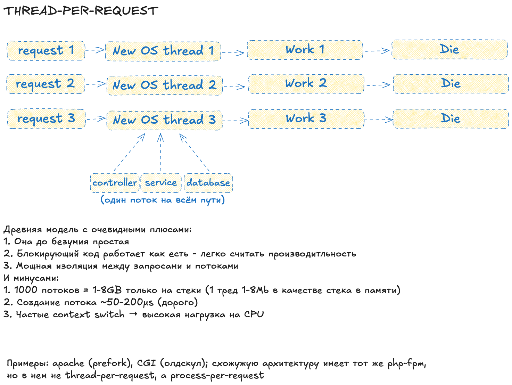

# Runtime models - как запускать тысячи функций одновременно

**The First Nine Guide. Блок 2**

***

**Дисклеймер** - в реальном мире системы и бэкенды сочетают несколько моделей, в чистом виде их почти нигде не существует.

***

В прошлой части мы разобрали атом кода - функцию. Поняли, как ее сложность и характеристики влияют на производительность.

Но в реальном мире приложения обрабатывают не одну, а тысячи и десятки тысяч функций одновременно. Кто управляет этим хаосом? Ответ - **модель исполнения (runtime model)**. Выбор этой модели - фундамент софтварной архитектуры.

Каждая модель отвечает на два вопроса:

1. Кто рулит потоками? (ядро рантайма или сам код)
2. Что будет, если поток блокируется?

Обсудим плюсы, минусы и где их использовать.

***

## 1. Thread-per-request

Первая и одна из древнейших моделей:

> один запрос - один поток - запрос завершился - поток умер.

**Кто рулит:** сам код создает тяжелые потоки и сразу забывает

**Вес:** 1-8 МБ на стек; создание ~100 мкс

**Если блокируется:** железо тупо простаивает

**Брать, если:** унаследованный монолит и 3 RPS - иначе нет.

***

## 2. Thread pool

Логичная эволюция предыдущей модели. Убираем оверхэд на создание и смерть, держим фиксированный пул тяжелых потоков и очередь задач. Сейчас в мире полно таких приложений, хотя модель олдскульная.

**Кто рулит:** пул раздает задачи готовым потокам

**Если блокируется:** поток висит, очередь пухнет

**Можно брать, если:** нагрузка смешанная (CPU + I/O), хотите прозрачности, тошнит от модного и молодежного.

***

> Следующие модели - попытка решить главную проблему пулов: простой тяжелых потоков во время ожидания I/O.

***

## 3. Event loop

Радикально иной подход. Вместо армии воркеров у нас есть один, но шустрый **диспетчер (event loop)**, работающий на одном тяжелом потоке. Он инициирует асинхронную операцию (например, запрос в БД) и тут же переключается на другие события. Когда результат готов, обрабатывает его.

> опрос I/O - колбэки - таймеры - ...

**Кто рулит:** сам loop; тяжелый поток всего один

**Если блокируется:** замирает все приложение

**Брать, если:** чистый I/O и минимум CPU.

***

## 4. Fibers

Это не отдельная модель, а подход, который прокачивает event loop (и не только), частично решая проблему callback hell. Логика пишется внутри легких потоков (файберов). Event loop по-прежнему управляет всем, но теперь он не вызывает колбэки, а возобновляет (resume) нужный файбер. Сам файбер, дойдя до I/O, добровольно отдает управление (yield), позволяя коду выглядеть линейным. Файберы могут вызывать друг друга по логике, которую диктует не рантайм, а сам разработчик.

**Кто рулит:** больше контроля у разработчика, но руль у рантайма

**Если блокируется:** блокирует loop так же

**Брать, если:** хочется чистый асинхрон в I/O-сервисе.

***

## 5. Green threads

Это старая модель, прототип многих новых. В ней много легких потоков внутри одного тяжелого. Рантайм переключает их по таймеру.

**Кто рулит:** рантайм, все живут в одном тяжелом потоке

**Если блокируется:** если любой из легких потоков делает блокирующий системный вызов, он блокирует тот единственный тяжелый поток. Вся работа останавливается.

**Брать, если:** прототип, маленький скрипт, лабораторка.

***

## 6. Virtual threads

Это геймченджер. Эволюция green threads. Миллионы легких потоков, управляемых планировщиком рантайма и исполняемых на небольшом пуле тяжелых потоков. Реальная крутость - в блокировках.

**Кто рулит:** рантайм создает легкие потоки, планировщик распределяет их по пулу тяжелых

**Если блокируется:** легкий поток инициирует I/O, планировщик не дает ему заблокировать тяжелый поток. Он "паркует" легкий поток и ставит на его место другой. Тяжелый поток не простаивает.

*При blocking I/O (например, Thread.sleep() или File.read() на обычном сокете) возможен pinning, что снижает эффективность.*

**Брать, если:** современный high-load и море сетевых вызовов. Но не забывайте про mutex, таймауты и fail-fast, чтобы не накапливать миллионы легких потоков в ожидании.

***

## 7. Actor model

Это не совсем модель рантайма, а модель конкурентности, но сильно влияет на архитектуру. В ней нет общей памяти: акторы общаются сообщениями. Планировщик разбрасывает акторов по потокам-исполнителям.

Принципы:

- нет общего состояния
- только обмен сообщениями, никакой шаренной памяти или локов
- один актор обрабатывает одно сообщение за раз
- "let it crash" философия устойчивости

**Кто рулит:** рантайм акторов; актор обрабатывает по одному сообщению

**Если блокируется:** блокирует только себя, остальные работают

**Брать, если:** нужна высокая отказоустойчивость и готовый фреймворк. Можно применять и к микросервисам, и к внутренней архитектуре сервиса.

***

## Сводная таблица

***

## Гибридные модели и где они обитают

В реальности чистые модели встречаются редко. Современные рантаймы комбинируют подходы, устраняя слабости каждого.

Шортлист:

1. Worker threads + event loop. Видим в Node.js (c Worker Threads). Основной event loop для I/O + пул воркеров для CPU-задач.
2. Multi-loop architecture. Встречается в Vert.x. Несколько event loop'ов работают параллельно, каждый на своем тяжелом потоке. Балансировщик распределяет входящие соединения.
3. Actor model + thread pools. Типичный подход Akka с настраиваемыми диспетчерами. Разные типы акторов на разных пулах: I/O-акторы на большом пуле, CPU-акторы на маленьком, критичные на выделенных потоках.

***

> В следующем выпуске - **[разбор типичных архитектур приложения](inner-architecture.md)**.
>
> В предыдущей серии - **[разбирались с атрибутами функции](function-atomic-unit.md)**.

Подписывайся на канал [@r9yo11yp9e](https://t.me/r9yo11yp9e) - будем искать девятки вместе.
